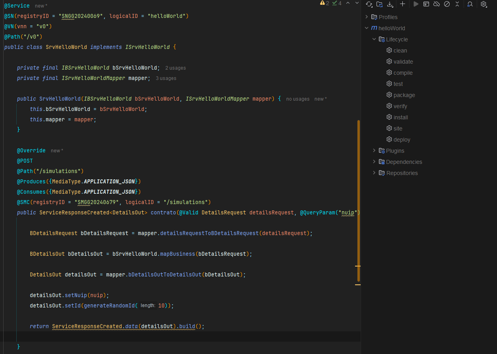
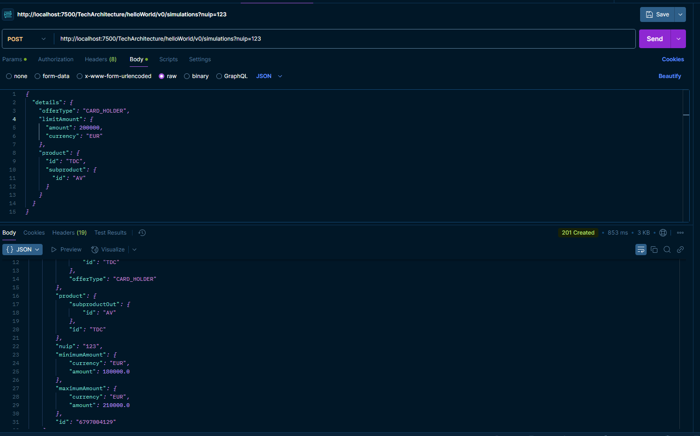

# DOCUMENTACION ASO-SERVICE-PROJECT

## Introducción
En este documento se registran los datos que pueden ser relevantes durante el desarrollo del mismo, con la finalidad de dar apoyo en la comprensión de la toma de decisiones para el desarrollo de un servicio **API-REST (ASO)**.

## Consideraciones
- Al no ser un ejercicio funcional, se hizo un mapeo muy sencillo para mantener una estructura de flujo Facade -> Business -> DAO -> Facade, tratando de simular un servicio real en la medida de lo posible.
- El ejercicio toma como base un ejercicio de clase, por lo que la carpeta mantiene el nombre asoexample_first_service.
 - Los nombres de las clases e interfaces (SrvHelloWorld y derivados) fueron refactorizados (renombrados) según lo visto en clase para mejorar la comprensión. Sin embargo, los problemas fueron demasiados y no fue posible solventarlos, por lo que se mantuvieron idénticos a los manejados anteriormente.
- En un principio, estaba pensado el uso de **MapStruct** para facilitar el mapeo y manejo de los datos a través del flujo del servicio. Sin embargo, debido a la falta de dominio de la herramienta y múltiples complicaciones, se optó por realizar un mapeo manual.

## Tecnologías
- **Docker** para el levantamiento de un contenedor que permite el manejo del entorno local.
- **Postman** para el consumo de los servicios HTTP (POST).
- **IntelliJ IDEA** como entorno de desarrollo.
- **Plugin Lombok** para reducir el número de líneas de código y evitar la generación manual de getters y setters cada vez que se modificaran los parámetros y objetos contenidos dentro de los DTOs de entrada y salida.
- **Plugin JetBrains AI Assistant** como apoyo para el desarrollo del servicio.

## Resultados
Se adjuntan imagenes de prueba de los resultados finales



)

## Código
Se trató de reproducir lo visto en clase.

- Para la inyección de dependencias se eligió el uso de constructores, ya que es considerada una buena práctica:
  
```
private final IBSrvHelloWorld bSrvHelloWorld;
	private final ISrvHelloWorldMapper mapper;

	public SrvHelloWorld(IBSrvHelloWorld bSrvHelloWorld, ISrvHelloWorldMapper mapper) {
		this.bSrvHelloWorld = bSrvHelloWorld;
		this.mapper = mapper;
	}
```

- Para la generación de id aleatorio (con ayuda de AI Assistant)

```
private String generateRandomId(int length) {
		String chars = "0123456789";
		StringBuilder id = new StringBuilder();
		for (int i = 0; i < length; i++) {
			id.append(chars.charAt((int) (Math.random() * chars.length())));
		}
		return id.toString();
	}
```

## Conclución
Para la realización del proyecto se aplciaron los conocimientos obtenidos en el curso de Hack a Boss. Desde una perspectiva personal, se logro el objetivo de aplicar y consolidar los conocimientos adquiridos en diversas áreas, construyendo una API REST robusta y eficiente.
